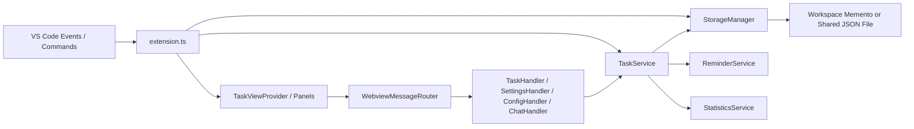

# ToDo4VCode Architecture

This document describes how ToDo4VCode is structured today and how to extend it safely.

## 1. System Overview

ToDo4VCode is a VS Code extension with a layered architecture:

- `src/core`: business logic, models, storage, and services.
- `src/ui`: VS Code UI integration (sidebar webview, full-screen panel, settings panel, status bar).
- `src/commands`: command entry points registered in `package.json`.
- `media`: frontend runtime for webviews (`main.js` + SCSS/CSS + assets).

The extension keeps task behavior in services and uses UI layers as adapters.

## 2. High-Level Runtime Flow



## 3. Folder Map

```text
src/
├── commands/
│   ├── refresh.ts
│   ├── openFull.ts
│   ├── openConfig.ts
│   ├── openTaskModal.ts
│   ├── codeSelectionTasks.ts
│   └── index.ts
├── core/
│   ├── constants/
│   │   └── media-paths.ts
│   ├── models/
│   │   ├── task.ts
│   │   ├── settings.ts
│   │   ├── webview-messages.ts
│   │   └── index.ts
│   ├── services/
│   │   ├── TaskService.ts
│   │   ├── ConfigService.ts
│   │   ├── ReminderService.ts
│   │   ├── StatisticsService.ts
│   │   └── ImportExportService.ts
│   └── storage/
│       └── StorageManager.ts
├── ui/
│   ├── providers/
│   │   └── TaskViewProvider.ts
│   ├── panels/
│   │   ├── FullScreenPanel.ts
│   │   └── ConfigPanel.ts
│   ├── statusbar/
│   │   └── StatusBarManager.ts
│   └── webview/
│       ├── TaskWebview.ts
│       ├── ConfigWebview.ts
│       ├── WebviewMessageRouter.ts
│       └── handlers/
│           ├── BaseHandler.ts
│           ├── TaskHandler.ts
│           ├── SettingsHandler.ts
│           ├── ConfigHandler.ts
│           └── ChatHandler.ts
├── utils/
│   ├── logger.ts
│   ├── validators.ts
│   └── sound-player.ts
├── test/
│   ├── runTest.ts
│   ├── mocks/vscode.ts
│   └── suite/
│       ├── testUtils.ts
│       ├── storageManager.test.ts
│       └── taskService.test.ts
└── extension.ts

media/
├── main.js
├── styles/
│   ├── main.scss
│   ├── main.css
│   ├── base/
│   ├── components/
│   ├── layouts/
│   └── vendors/
├── flatpickr.*
├── codicons/
├── icon.svg
├── icon.png
└── ding-ding-alert.mp3
```

## 4. Core Services and Responsibilities

### TaskService

`TaskService` is the central domain service. It handles:

- Task CRUD operations.
- Subtask operations.
- Task ordering.
- Tag normalization and deduplication.
- Reminder scheduling hooks.
- Statistics computation integration.
- Comment scan import (`// TODO`, `// FIXME`, `// NOTE`).
- Shared tasks refresh reactions from `StorageManager`.

It emits:

- `onTasksChanged`
- `onSettingsChanged`
- `onReminder` (proxied from `ReminderService`)

### StorageManager

`StorageManager` abstracts persistence and supports two modes:

1. Local workspace/global memento state.
2. Shared file mode (`todo4vcode.sharedTasks.enabled`).

In shared mode, tasks are saved in a relative project file (default: `.todo4vcode/shared-tasks.json`) and watched for external changes.

### ConfigService

`ConfigService` is the typed wrapper over VS Code settings. It exposes:

- Read operations (`getExtensionConfig`, `getStatisticsConfig`, etc.).
- Update operations (`updateHideCompleted`, `updateSharedTasksPath`, etc.).
- Change filters (`affectsCommentScanConfig`, `affectsSharedTasksConfig`, etc.).

### ReminderService

`ReminderService` schedules and triggers due reminders. It notifies UI through `TaskService.onReminder`.

### StatisticsService

`StatisticsService` computes aggregate counts (`total`, `done`, `must`, `inProgress`, `overdue`) from current tasks.

### ImportExportService

`ImportExportService` exports/imports:

- Tasks
- View settings (`sidebar`, `full`)
- Extension configuration (including shared tasks config)

## 5. Persistence Model

### Local Storage

- Tasks key: `todo4vcode-tasks`
- Settings keys:
  - `todo4vcode-settings` (sidebar)
  - `todo4vcode-settings-full` (full screen)

Storage target uses workspace state when possible, otherwise global state.

### Shared File Storage

When shared mode is enabled, the storage file payload is:

```json
{
  "format": "todo4vcode-shared-tasks",
  "version": "1.0.0",
  "tasks": []
}
```

Important behavior:

- Path must be relative to workspace root.
- Parent directories are created automatically.
- Invalid JSON keeps the last valid in-memory snapshot and shows a warning.
- File watcher emits `external` updates to refresh all views.

## 6. Commands

Registered command IDs:

- `todo4vcode.refresh`
- `todo4vcode.openFull`
- `todo4vcode.openConfig`
- `todo4vcode.openTaskModal`
- `todo4vcode.addSelectionAsTask`
- `todo4vcode.attachSelectionToTask`

### Editor Context Menu Commands

`todo4vcode.addSelectionAsTask` and `todo4vcode.attachSelectionToTask` are contributed to `editor/context` with:

- `editorTextFocus && editorHasSelection`

Both commands:

1. Read the current code selection.
2. Build a code reference tag.
3. Reveal the ToDo4VCode sidebar container.
4. Open the task modal directly.

## 7. Code Reference Tags

Code tags are stored in `TodoItem.tags` (no schema change).

Supported formats:

- Single position: `path/to/file.ts:12:4`
- Multi-line range: `path/to/file.ts:10-15`
- Full range with columns: `path/to/file.ts:10:3-15:20`

`TaskHandler.openCodeLink` parses these formats, resolves the target file, opens the editor, and selects/reveals the matching position or range.

## 8. Webview Architecture

### HTML producers

- `TaskWebview.ts`
- `ConfigWebview.ts`

### Frontend runtime

- `media/main.js`

`main.js` handles rendering, UI interactions, drag-and-drop ordering, modal behavior, tag parsing, and message dispatch to the extension host.

### Message routing

`WebviewMessageRouter` dispatches messages to specialized handlers:

- `TaskHandler`: task + subtask mutations and code-link navigation.
- `SettingsHandler`: view settings sync + initial ready handshake.
- `ConfigHandler`: extension settings updates + import/export + shared path prompt.
- `ChatHandler`: copy/send task prompt behavior.

### Robust modal opening

`TaskViewProvider.openTaskModal(taskId)` uses a pending queue and waits until webview readiness. The frontend also queues `openTaskModal` requests if tasks are not yet available.

## 9. Activation and Event Orchestration (`extension.ts`)

`activate()` builds and wires all main components:

- Services: `StorageManager`, `TaskService`
- UI: `TaskViewProvider`, `FullScreenPanel`, `ConfigPanel`, `StatusBarManager`
- Commands registration
- Subscriptions for:
  - Task changes -> refresh views + status bar
  - Config changes -> re-sync views/status/comment scan
  - Document save -> incremental comment scan

On startup, comment scan can run immediately if enabled.

## 10. Comment Scan Pipeline

`TaskService.importCommentTasksFromWorkspace()`:

1. Scans project files with include/exclude globs.
2. Skips large/binary-like files.
3. Parses line comments for `TODO|FIXME|NOTE` markers.
4. Builds/upserts tasks with `source: comment-scan` metadata.
5. Removes stale scanned tasks when source entries disappear.

This workflow is serialized through an internal queue to avoid overlapping scans.

## 11. Testing

Current automated tests run with Node's test runner and a local `vscode` mock:

- `src/test/suite/storageManager.test.ts`
- `src/test/suite/taskService.test.ts`

Run:

```bash
npm test
```

`npm test` executes compile + lint in `pretest`, then runs `out/test/runTest.js`.

## 12. Extension Points: How to Add Features Safely

### Add a new command

1. Create a command module under `src/commands/`.
2. Export it from `src/commands/index.ts`.
3. Register it in `src/extension.ts`.
4. Contribute it in `package.json` (`contributes.commands` and optionally menus).

### Add a new webview message

1. Add message types in `src/core/models/webview-messages.ts`.
2. Add validation rules in `src/utils/validators.ts` when needed.
3. Route in `src/ui/webview/WebviewMessageRouter.ts`.
4. Handle in the corresponding handler.
5. Wire sender/listener in `media/main.js`.

### Add new settings

1. Add settings schema in `package.json`.
2. Extend `settings.ts` models.
3. Add getters/updaters in `ConfigService`.
4. Handle updates in `ConfigHandler` and surface in `ConfigWebview`.

## 13. Architectural Guidelines

- Keep business logic in `core/services`, not in webview handlers.
- Keep handlers thin and focused on message adaptation.
- Reuse `TaskService` for state transitions to preserve normalization and events.
- Use `Logger` instead of raw console statements.
- Prefer non-breaking message contract evolution for webview updates.
