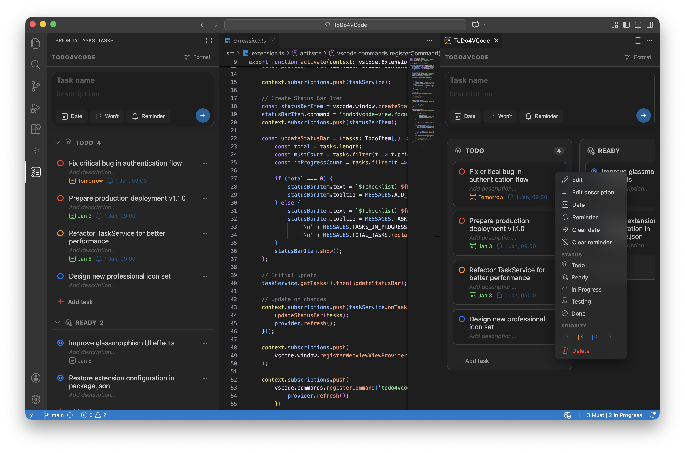
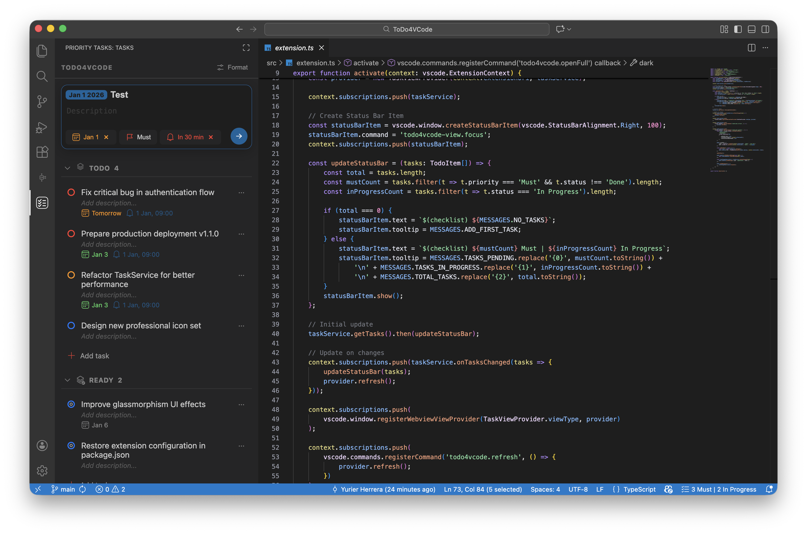
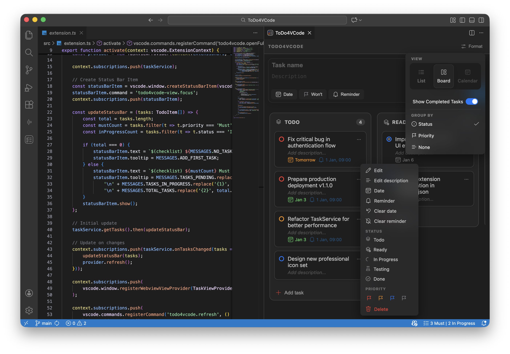
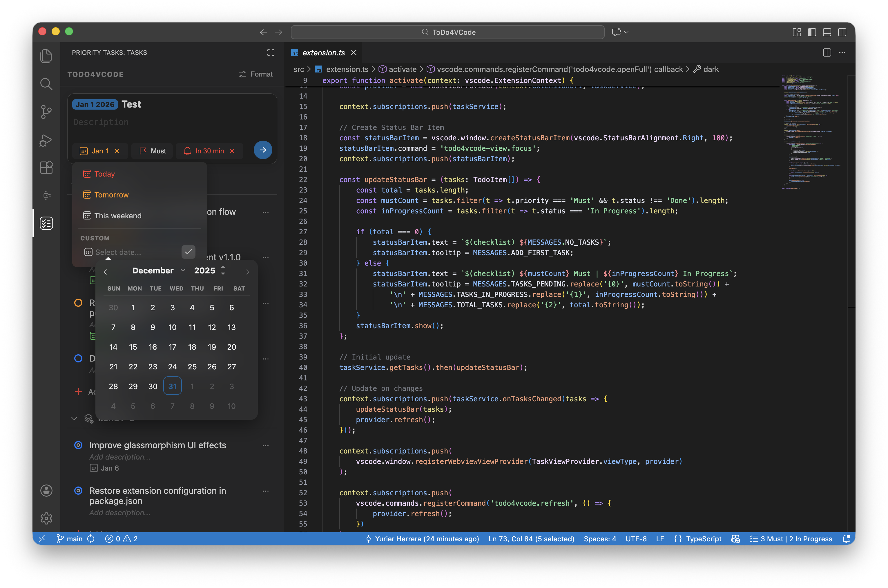
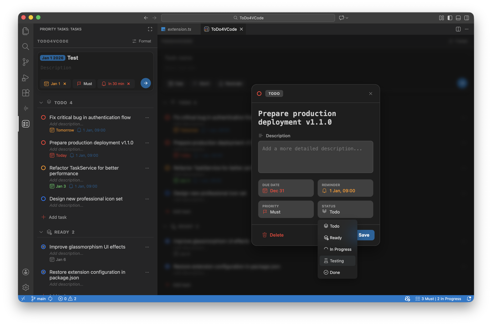
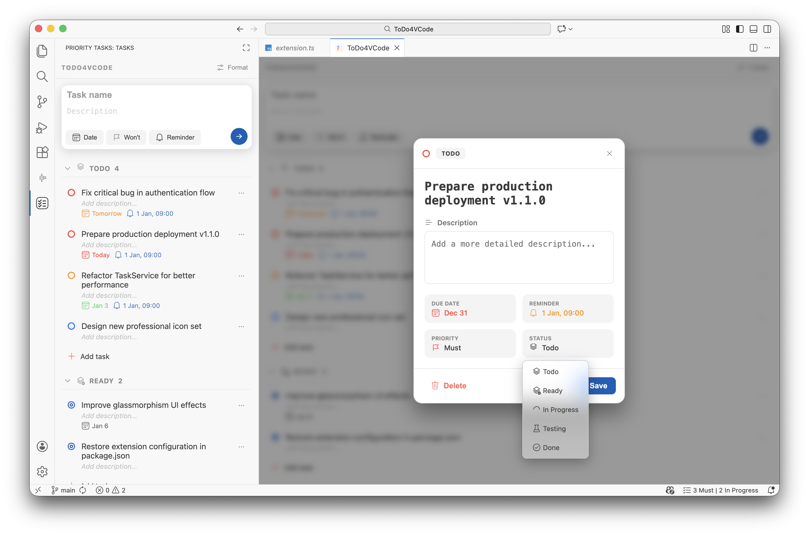

# ToDo4VCode

Stop drowning in endless todo lists. **ToDo4VCode** is a professional task management extension for VS Code that helps you organize project tasks by their true impact, ensuring you always focus on what matters most.

## 🚀 Smart Prioritization

This extension uses the proven MoSCoW technique to help you categorize tasks effectively:

- **Must (M)**: Critical tasks that are non-negotiable for the current milestone.
- **Should (S)**: Important tasks that should be done, but aren't vital.
- **Could (C)**: "Nice to have" tasks that add value if time permits.
- **Won't (W)**: Tasks acknowledged as not being a priority for now.

## ✨ Key Features

- 🎯 **Impact-Driven Organization**: Categorize tasks by priority to maintain focus.
- 📁 **Workspace-Specific Lists**: Keep your project tasks isolated and relevant to your current work.
- 📊 **Multiple Views**: Switch between a clean **List View** and a productive **Kanban Board**.
- 🔔 **Smart Reminders**: Integrated VS Code notifications for upcoming deadlines.
- 🧹 **Zero Clutter**: Data is stored securely in VS Code's internal storage.
- 🌓 **Native Integration**: Fully supports VS Code themes and Codicons for a seamless experience.

## 📸 Features in Action

### 1. Main Interface (Hero Shot)
The extension integrates perfectly into your VS Code sidebar, providing a clean and professional look.

### 2. Organized List View
Manage your tasks with clear priorities and due dates. The UI highlights urgent tasks so you never miss a deadline.

### 3. Productive Kanban Board
Visualize your workflow and move tasks between states with our intuitive Kanban board.

### 4. Smart Calendar & Reminders
Set due dates with a clean, integrated calendar. Get notified when tasks are due.

### 5. Detailed Task Management
Edit every detail of your tasks, including descriptions and specific priorities, in a focused modal.

### 6. Full Theme Support
Whether you prefer Dark or Light themes, ToDo4VCode adapts beautifully to your workspace.

## 🛠 How to Use

1. **Open the Sidebar**: Click the Priority Tasks icon in the Activity Bar.
2. **Add a Task**: Type your task name, set a priority, and add an optional description or due date.
3. **Manage**: Drag and drop tasks in Kanban mode or use the context menu to update status and priority.
4. **Focus**: See your pending high-priority tasks at a glance.

## ⚙️ Configuration

You can customize the extension behavior in your VS Code settings:

- `todo4vcode.hideCompleted`: Toggle to hide or show completed tasks in your list.
- `todo4vcode.defaultPriority`: Set the default priority for newly created tasks (Must, Should, Could, Wont).

## 💻 Development & Installation

### Development Mode
1. Clone the repository.
2. Run `npm install`.
3. Press `F5` to open the **Extension Development Host**.

### Permanent Installation (VSIX)
1. Install `vsce`: `npm install -g @vscode/vsce`.
2. Package: `vsce package`.
3. Install the generated `.vsix` file via the Extensions view.

## 🚀 Publishing

This extension is published to both the [VS Code Marketplace](https://marketplace.visualstudio.com/items?itemName=yurierherrera.todo4vcode) and [Open VSX Registry](https://open-vsx.org/extension/YurierHerrera/todo4vcode).

### For Maintainers

Publishing requires Personal Access Tokens (PATs) configured as GitHub repository secrets:
- `VSCE_PAT` - Token from Azure DevOps for VS Code Marketplace
- `OVSX_PAT` - Token from Open VSX Registry

For detailed setup instructions, see [CONTRIBUTING.md](./CONTRIBUTING.md#setting-up-marketplace-tokens).

The GitHub Actions workflow automatically publishes new versions when a tag starting with `v` is pushed to the repository.

## 🤝 Contributing

Contributions are welcome! Please see [CONTRIBUTING.md](./CONTRIBUTING.md) for detailed guidelines on:
- Setting up your development environment
- Configuring marketplace tokens for publishing
- Code style guidelines
- Pull request process

---
*Built with ❤️ for developers who value their time.*
