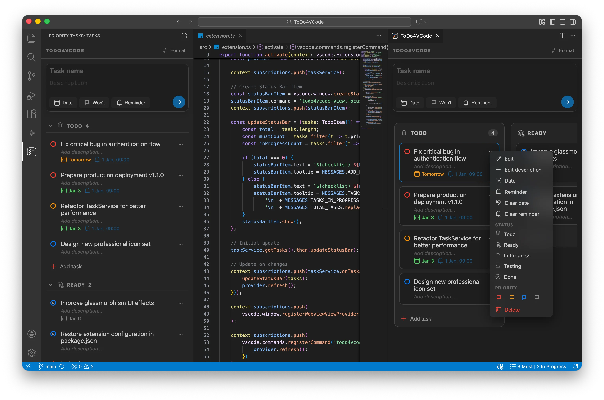
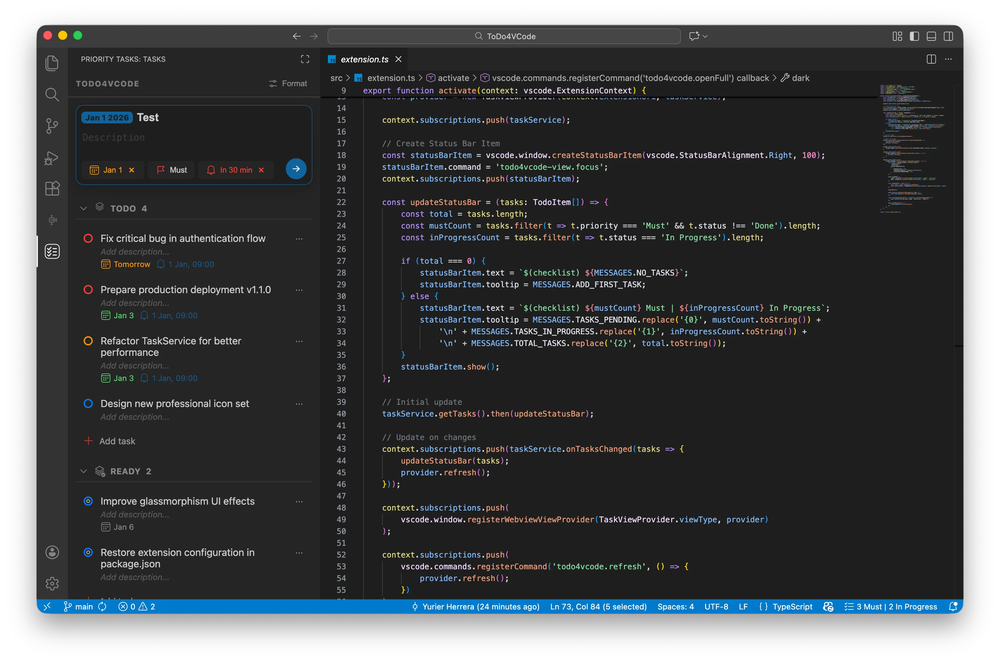
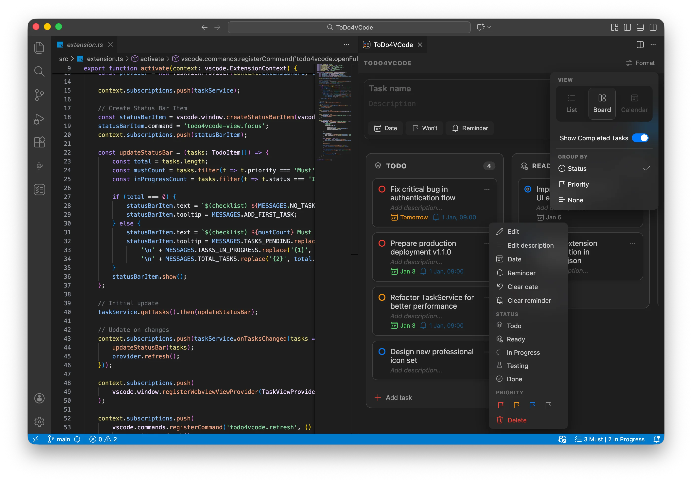
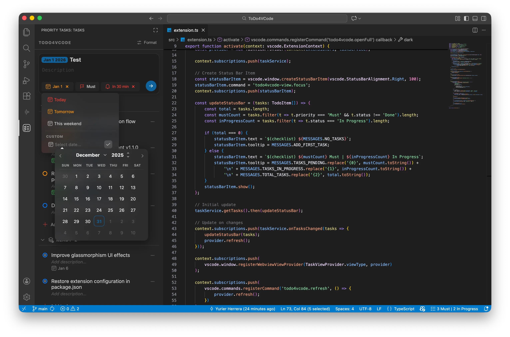
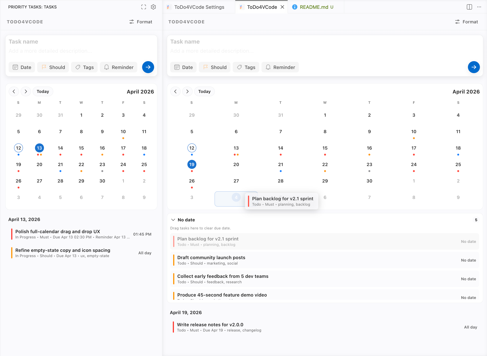
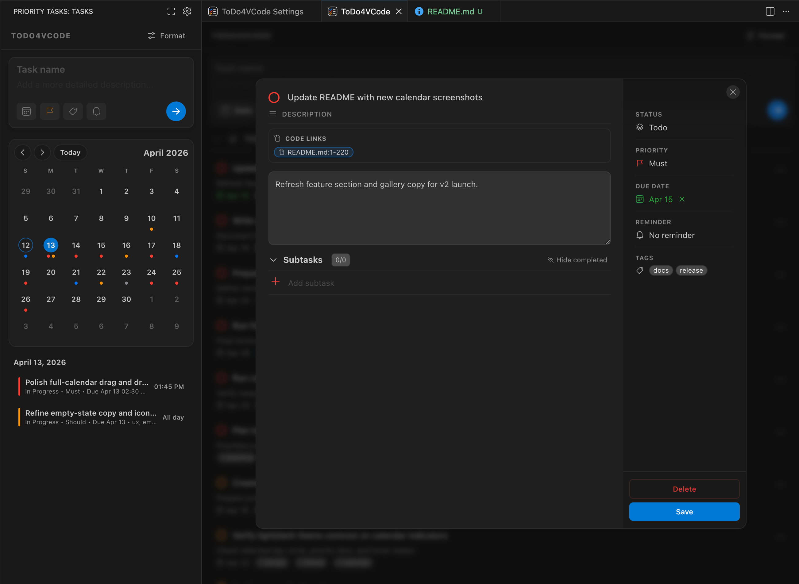
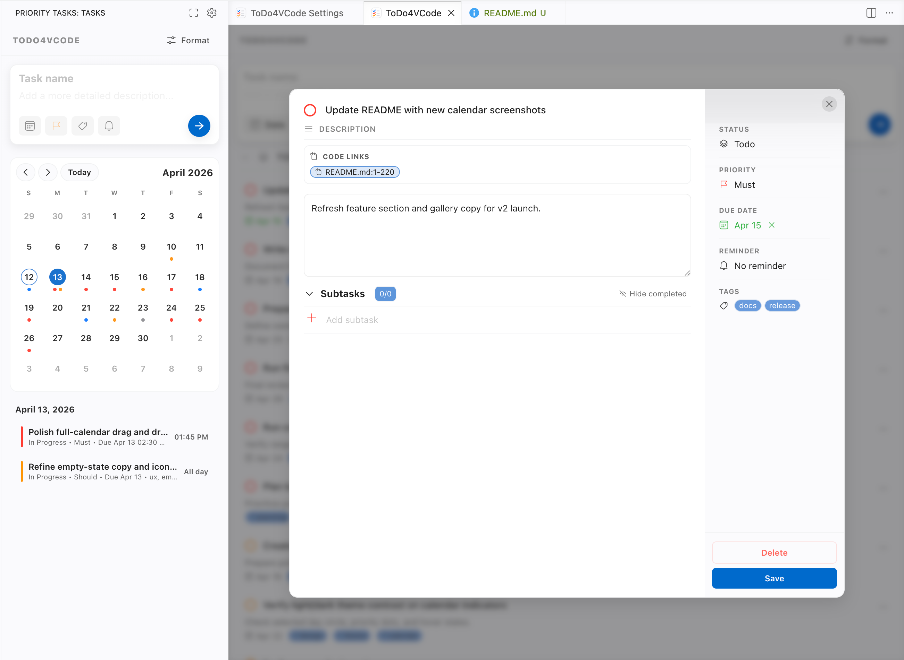

# ToDo4VCode

Stop drowning in endless todo lists. **ToDo4VCode** is a professional task management extension for VS Code and VS Code-compatible editors (such as Cursor and other forks) that helps you organize project tasks by their true impact, ensuring you always focus on what matters most.

## 🚀 Smart Prioritization

This extension uses the proven MoSCoW technique to help you categorize tasks effectively:

- **Must (M)**: Critical tasks that are non-negotiable for the current milestone.
- **Should (S)**: Important tasks that should be done, but aren't vital.
- **Could (C)**: "Nice to have" tasks that add value if time permits.
- **Won't (W)**: Tasks acknowledged as not being a priority for now.

## ✨ Key Features

- 🎯 **Impact-Driven Organization**: Categorize tasks by MoSCoW priority to keep focus on real impact.
- 📊 **Three Views, One Workflow**: Switch between **List**, **Kanban**, and **Calendar** views.
- 📅 **Compact Calendar (Sidebar)**: Navigate months quickly, see priority dots per day, and review selected-day tasks in a scrollable panel.
- 🧲 **Visual Planning in Full Screen**: Drag tasks across the full calendar planning matrix:
  - `No date -> Day`
  - `Day -> Day`
  - `Day -> No date`
- 🔎 **Advanced Filtering Everywhere**: Search, tags, and hide-completed filters are applied consistently across calendar indicators and task lists.
- ✅ **Subtasks Support**: Break down complex tasks with completion tracking.
- 🧩 **Code-to-Task Linking**: Create tasks directly from editor selections with code references.
- 🔔 **Smart Reminders**: Receive in-editor reminders for due tasks.
- ⚙️ **Configuration Panel**: Manage behavior, statistics, reminders, and data options.
- 🤝 **Shared Tasks for Teams**: Optionally store tasks in `.todo4vcode/shared-tasks.json` for Git collaboration.
- 💾 **Import/Export Data**: Backup or migrate all workspace task data in JSON format.
- 🌓 **Native VS Code Integration**: Theme-aware UI, Codicons, and lightweight performance.

## 📊 StatusBar Statistics

ToDo4VCode automatically displays task statistics in VS Code's status bar (bottom-right corner). The status bar item shows a quick summary of your most critical tasks:

- **Display**: Shows count of "Must" priority tasks and tasks "In Progress"
- **Tooltip**: Hover over the status bar item to see detailed statistics including:
  - Total number of tasks
  - Completed tasks count
  - Must priority tasks count
  - Tasks in progress
  - Overdue tasks count

The statistics update in real-time as you manage your tasks. You can customize which statistics appear in the tooltip through VS Code settings.

## 📸 Features in Action

### 1. Main Interface (Hero Shot)
Clean sidebar-first workflow inside VS Code with quick task creation and view switching.

### 2. Focused List View
Prioritize and execute tasks with clear status, priority, and due-date signals.

### 3. Kanban Workflow
Move tasks across states to track delivery progress visually.

### 4. Compact Calendar in Sidebar
Monthly navigation, selected-day highlight, and MoSCoW priority dots in a compact layout.

### 5. Full Calendar Planning (Drag & Drop)
Plan visually by dragging tasks between **No date** and calendar days in full-screen mode.

### 6. Detailed Task Editor
Edit title, description, subtasks, reminders, and priority in one focused modal.

### 7. Theme Compatibility
Consistent UI in light and dark themes across all views.

## 🛠 How to Use

1. **StatusBar**: The extension activates automatically when VS Code starts. Check the status bar (bottom-right) to see your task summary at a glance. Hover over it for detailed statistics.

2. **Open the Sidebar**: Click the Priority Tasks icon in the Activity Bar to access the full task management interface.

3. **Add a Task**: Type your task name, set a priority, and add an optional description or due date. You can also add reminders for important deadlines.

4. **Manage Tasks**: 
   - **Drag and Drop**: Move tasks between columns in Kanban mode or reorder them in List view
   - **Context Menu**: Right-click any task to quickly update status, priority, or add dates/reminders
   - **Task Modal**: Click on a task to open detailed view where you can edit all properties

5. **Subtasks**: Open a task's detail modal to add subtasks. Track progress with the completion counter (X/Y completed).

6. **Link Code to Tasks**:
   - Select code in the editor and right-click.
   - Use **ToDo4VCode: Add Selection as New Task** to create a new task with a code reference tag.
   - Use **ToDo4VCode: Attach Selection to Existing Task** to pick an existing task from Quick Pick.
   - The task modal opens automatically in the sidebar, and the tag can represent a line or a range.

7. **Full Screen Mode**: Click the "Open in full screen" button in the sidebar header for a distraction-free task management experience.

8. **Configuration**: Click the settings icon in the sidebar header to access the configuration panel where you can:
   - Adjust general preferences (hide completed tasks, default priority)
   - Enable/disable shared tasks and edit the shared file path
   - Configure statistics display
   - Manage notification settings
   - Import/Export workspace data
   - Clear all tasks if needed

9. **Import/Export Data**: 
   - **Export**: Save all your tasks, settings, and configurations to a JSON file (defaults to Downloads folder)
   - **Import**: Restore your workspace from a previously exported JSON file
   - The JSON format is compatible with coding tools and can be used with AI agents for task planning

10. **Focus**: See your pending high-priority tasks at a glance in the status bar and sidebar.

## ✅ Subtasks

Break down complex tasks into smaller, manageable subtasks:

1. **Add Subtasks**: Open any task's detail modal and scroll to the "Subtasks" section. Click "Add subtask" and type your subtask name.

2. **Manage Subtasks**: 
   - **Complete**: Click the checkbox next to a subtask to mark it as done
   - **Edit**: Click on the subtask text to edit it inline
   - **Delete**: Click the trash icon to remove a subtask

3. **Track Progress**: The subtasks section header shows completion progress (e.g., "3/5" means 3 out of 5 subtasks completed).

4. **Hide Completed**: Toggle the "Hide completed" button to focus only on remaining subtasks.

Subtasks help you track detailed progress within larger tasks and maintain clarity on what needs to be done.

## ⚙️ Configuration

You can customize the extension behavior in your VS Code settings:

### Task Management
- `todo4vcode.hideCompleted`: Toggle to hide or show completed tasks in your list.
- `todo4vcode.defaultPriority`: Set the default priority for newly created tasks (Must, Should, Could, Wont).
- `todo4vcode.sharedTasks.enabled`: Store tasks in a shared workspace file for collaboration via Git.
- `todo4vcode.sharedTasks.path`: Relative path to the shared tasks file (default: `.todo4vcode/shared-tasks.json`).

### Code References
- Code reference tags are stored in `tags` and can include ranges:
  - Single position: `src/file.ts:12:4`
  - Multi-line range: `src/file.ts:10-15`
  - Range with columns: `src/file.ts:10:3-15:20`
- Clicking a code-reference badge in a task opens the file and reveals the saved position/range.

### Statistics Display
Configure which statistics appear in the StatusBar tooltip:

- `todo4vcode.stats.showTotal`: Show total number of tasks (default: `true`)
- `todo4vcode.stats.showDone`: Show number of completed tasks (default: `true`)
- `todo4vcode.stats.showMust`: Show number of Must priority tasks (default: `true`)
- `todo4vcode.stats.showInProgress`: Show number of tasks in progress (default: `true`)
- `todo4vcode.stats.showOverdue`: Show number of overdue tasks (default: `true`)

To configure these settings, open VS Code Settings (Cmd/Ctrl + ,) and search for "todo4vcode".

## 💻 Development & Installation

### Development Mode
1. Clone the repository.
2. Run `npm install`.
3. Press `F5` to open the **Extension Development Host**.

### Automated Tests
1. Run `npm test`.
2. This command runs:
   - `npm run compile`
   - `npm run lint`
   - Node test runner via `out/test/runTest.js`

Current automated test suites cover:
- `StorageManager` local state behavior
- `TaskService` task creation and tag normalization/deduplication

### Permanent Installation (VSIX)
1. Install `vsce`: `npm install -g @vscode/vsce`.
2. Package: `vsce package`.
3. Install the generated `.vsix` file via the Extensions view.

## 🤝 Contributing

Contributions are welcome! Please see [CONTRIBUTING.md](./CONTRIBUTING.md) for detailed guidelines on:
- Setting up your development environment
- Code style guidelines
- Pull request process

## Credits

This extension uses [flatpickr](https://flatpickr.js.org/) for date picker functionality.

---
*Built with ❤️ for developers who value their time.*
